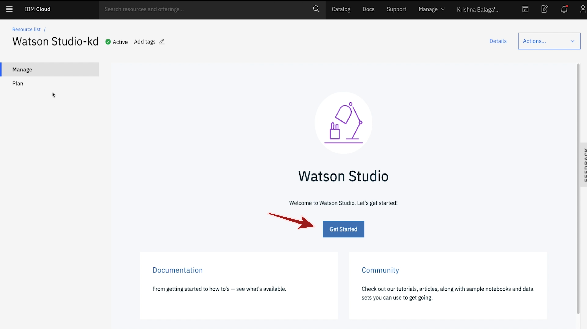
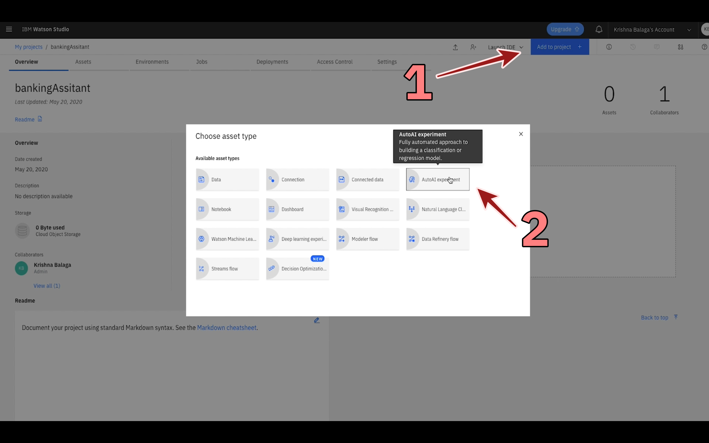
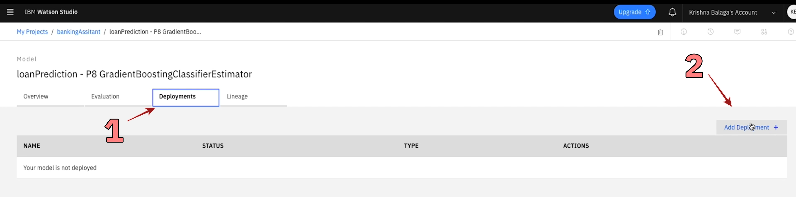

## AutoAI and WML

*Quick links :*
[Home](/README.md) - [**Part 1**](https://github.com/krishnac7/Smart-FAQ-Assistant/tree/master/Part1-Wml) - [Part 2](https://github.com/krishnac7/Smart-FAQ-Assistant/tree/master/Part2-Discovery) - [Part 3](https://github.com/krishnac7/Smart-FAQ-Assistant/tree/master/Part4-Functions) - [Part 4](https://github.com/krishnac7/Smart-FAQ-Assistant/tree/master/Part5-Assistant)
***

### Overview

In this, you will create a simple machine learning model using AutoAI and save the model using WML(Watson Machine Learning)

### Setup an instance of Watson Studio

1. Login to [IBM Cloud](https://cloud.ibm.com/login). From Catalog, filter the services by AI and click on Watson Studio. Either leave the defaults or change them accordingly and click on Create.

2. Once you click on Create, the service is provisioned. Click on Get Started.

3. Select Create an empty project.

4. Give a Unique name to your project. To add storage to your project, Click on Add->Provision a new COS instance or use the existing ones. Click on Refresh. Make sure your storage is added to your project and click on Create.

### Optional: Refining the data using Data Refinery

5. Go to Assets -> Add to project -> Data -> browse for the dataset train.csv and upload it here. Once the dataset is uploaded, click on refine which will open you the dataset in data refinery. Apply following operations/actions on the dataset.

<TODO: Add actions>

<TODO: Add gifs for data refinery>

Once the data is refined, create a job and save the refined dataset as showed below.

<TODO: Add gif for job creation>

### Run and Auto-AI Experiment

6. Within project assets, Add to project -> AutoAI Experiment.

7. Provide a unique name for your experiment, click on Associate a Machine learning Service, add an existing instance if you have any or use the defaults and create a new one. Go back to the project page and click on Reload. Click on create.

8. Either add the refinde data from previous step or download the dataset here and add it to autoai experiment.

9. Select the predict column to be loan status.

10. Click on Run the experiment. This will run the auto ai experiment using defaults but if you want to change anything, click on Experiment settings and edit them accordingly.

11. This will take some time to run. AutoAI will create multiple pipelines, you can sort them by multiple parameters as shown.

12. Once the process is completed, click on the first pipeline - pipeline 1.

13. Pipeline information is provided here. To save this model, from the right top corner click on Save as -> model.

### Save the model and create a deployment

14. Once the model is saved, click on View in project to open the model.

15. Model information like overview, evaluation, deployment and lineage are provided here. Go to Deployments and click on Add Deployment.

16. Provide a unique name and description(if any) and click on Save.

17. Wait for deployment status to say Ready and click on the created deployment.

18. Overview, Implementation and test are provided about the deployment. Go to Test, input the details and click on Predict to get the predictions from the model that has been saved.

Summary: We have created a machine learning model using autoai experiment and saved it using watson machine learning. And then created a web deployment to test the model.
