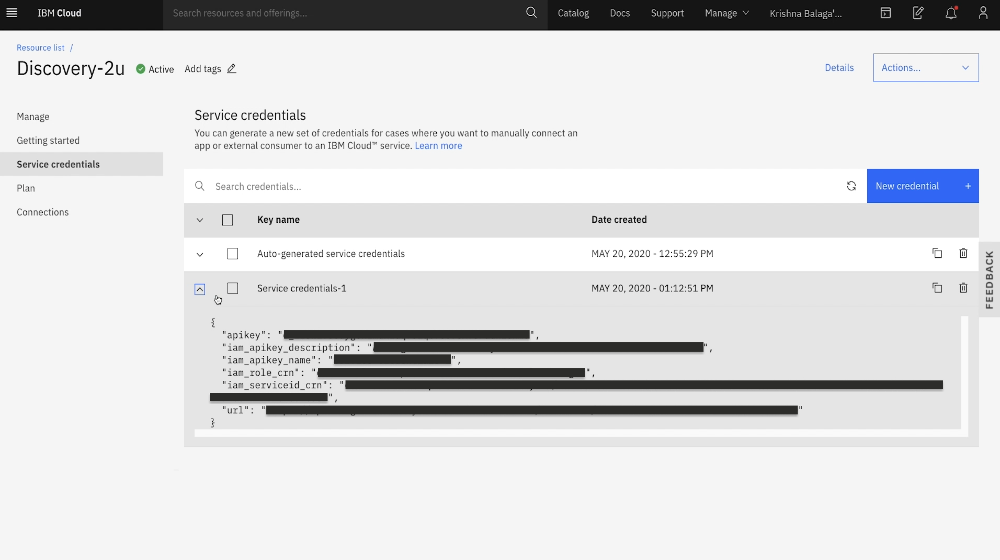

## Watson Discovery

*Quick links :*
[Home](/README.md) - [Part 1](https://github.com/krishnac7/Smart-FAQ-Assistant/tree/master/Part1-Wml) - [**Part 2**](https://github.com/krishnac7/Smart-FAQ-Assistant/tree/master/Part2-Discovery) - [Part 3](https://github.com/krishnac7/Smart-FAQ-Assistant/tree/master/Part4-Functions) - [Part 4](https://github.com/krishnac7/Smart-FAQ-Assistant/tree/master/Part5-Assistant)
***

### Overview

In this, you will provision an instance of Watson Discovery and

1. From Dashboard, go to Catalog and provision an instance of Watson Discovery. Opwn the provisioned instance from Resource list -> NAME_OF_YOUR_WATSON_DISCOVERY_INSTANCE. And the click on Launch Discovery.

2. Click on "Upload your own data" and then select "set up with current plan", this will set up storage. Provide the details of the collection and click on "Create".

3. Upload the document provided. This will take some time for processing.

4. Once the document is loaded, it will look like the following screen.

5. From the left side of the screen, click on the search icon.

6. Enter the provided Natural language query in the search tab i.e., "is tax payable on interest charged by banks on outstanding gold loan". And the click on Run query which will give you a Summary.

7. Go back to the home page of watson discovery which will show you the list of collections and open the collection you have just created. From the top right corner, click on "Configure data". This will open up your document that you have uploaded within the collection.

8. Select a page, add field labels to the pdf by selecting the data. In this case, its question label to the sentences in the document.

9. Similarly add answer field label too and click on "Submit page". Do this for all the pages required.

10. Go to "Manage fields", click on "split the document".

11. Select the label "question". And then click on "Apply changes to collection" from the right top corner of screen.

12. This will give you a pop-up asking to Upload documents. Select the document that will be provided to you.

13. This will take some time to load and you will be able to see the change in number of documents and field labels in the overview page.

14. Now click on search icon, search for "is tax payable on interest charged by banks on outstanding gold loans", click on "Run query".

15. Scroll down and open "More options"

16. Select the values as follows.

17. You will be able to see the answer in the summary screen.

18. Go to overview page, from the right top corner, click on "view api details", copy the collection id, configuration id and environment id.

19. From resource list, open watson discovery instance, click on "Service credentials".

20. Click on "New credential", use the defaults and create a new set of service credentials. Copy them.

