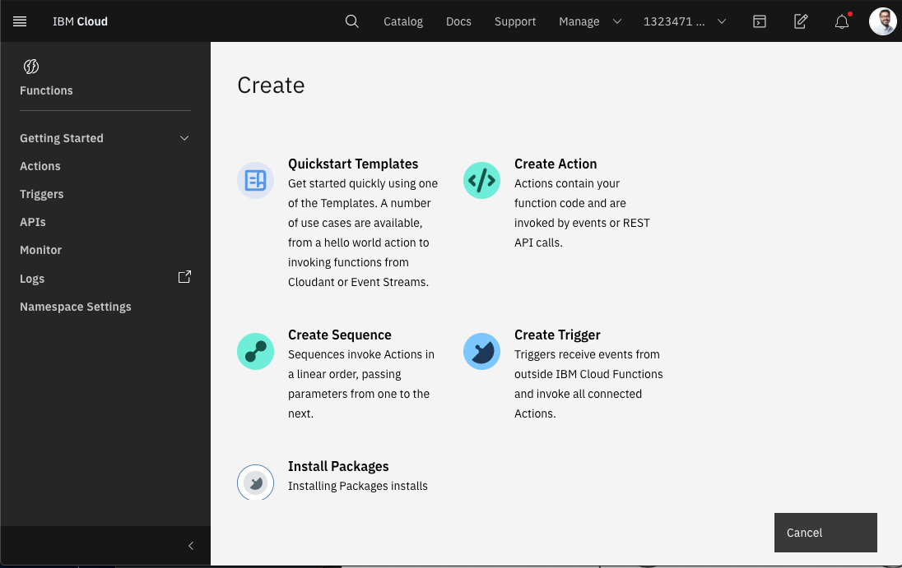
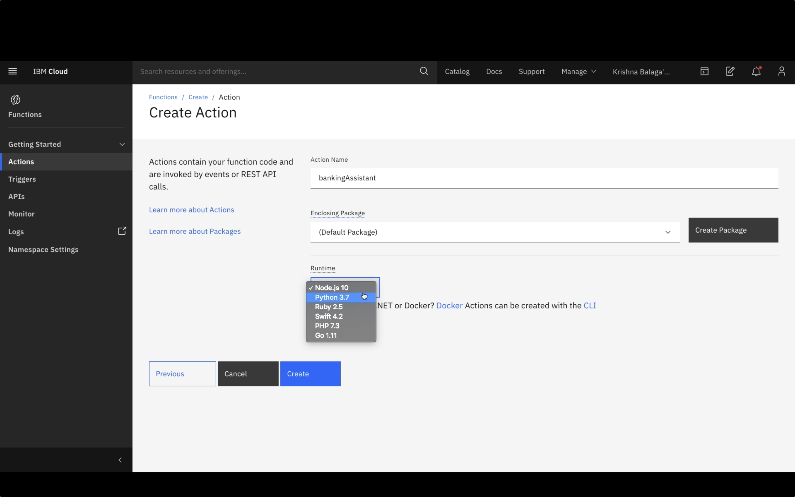
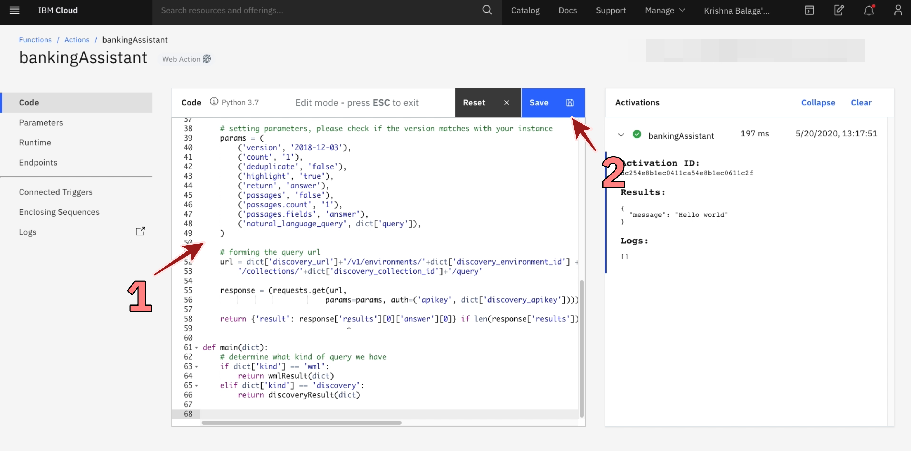
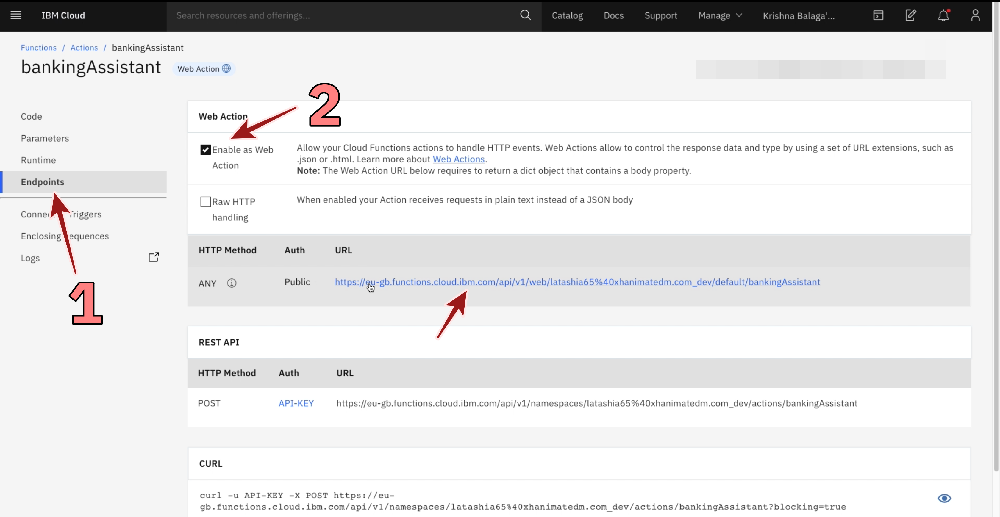

## Functions

*Quick links :*
[Home](/README.md) - [Part 1](https://github.com/krishnac7/Smart-FAQ-Assistant/tree/master/Part1-Wml) - [Part 2](https://github.com/krishnac7/Smart-FAQ-Assistant/tree/master/Part2-Discovery) - [**Part 3**](https://github.com/krishnac7/Smart-FAQ-Assistant/tree/master/Part3-Functions) - [Part 4](https://github.com/krishnac7/Smart-FAQ-Assistant/tree/master/Part4-Assistant)
***

### Overview

In this, you will create an action using cloud functions that will parse the data fetched from Watson Discovery and Watson Machine Learning.

### Create an action in Functions

1. From the navigation menu, click on Functions.

2. Select Actions.

3. Provide a name to your action and change the runtime to python 3.7.

4. Paste the code provided in this repo.

5. Go to parameters, click on Add parameter and provide the following parametes that are copied from discovery and watson machine learning.

6. Go to endpoints, click on "Enable as web Action" copy the url that is generated in this step.

