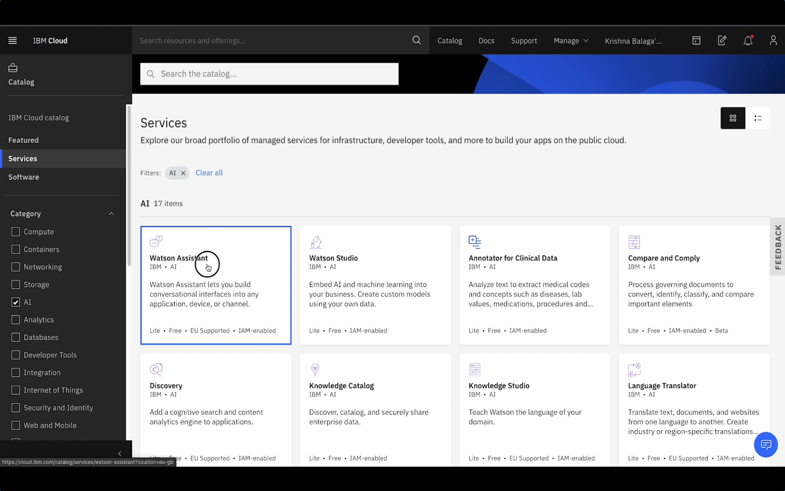
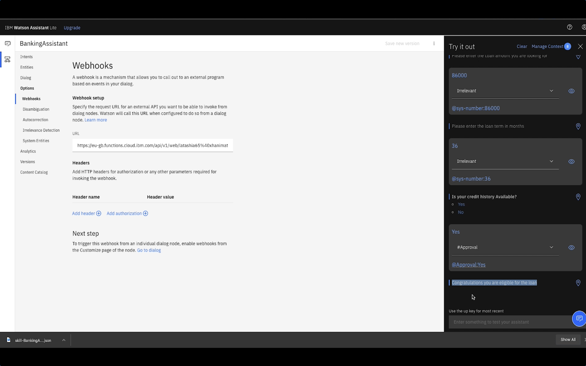

## Watson Assistant

*Quick links :*
[Home](/README.md) - [Part 1](https://github.com/krishnac7/Smart-FAQ-Assistant/tree/master/Part1-Wml) - [Part 2](https://github.com/krishnac7/Smart-FAQ-Assistant/tree/master/Part2-Discovery) - [Part 3](https://github.com/krishnac7/Smart-FAQ-Assistant/tree/master/Part4-Functions) - [**Part 4**](https://github.com/krishnac7/Smart-FAQ-Assistant/tree/master/Part5-Assistant)
***

### Overview

In this, you will create a simple watson assistant flow and enable webhooks which will fetch details from cloud functions.

### Setup an instance of Watson Assistant

1. Login to [IBM Cloud](https://cloud.ibm.com/login). From Catalog, filter the services by AI and click on Watson Assistant. Either leave the defaults or change them accordingly and click on Create. On successful provision, click on Launch Assistant.

2. Create a new skill, click on import flow and import the .json provided in the repo.

3. Once you import the flow, you will be able to see intents, entities and dialogs related to the flow. Click on "Try it" from the right top corner to see how the training works.

4. Goto webhooks and paste the url that we copied from the functions and add .json at the end of the url.

5. Click on "Try it" enter the parameters asked and check if its fetching details from the model that we deployed in wml. On successful completion, it will look something like the following.

