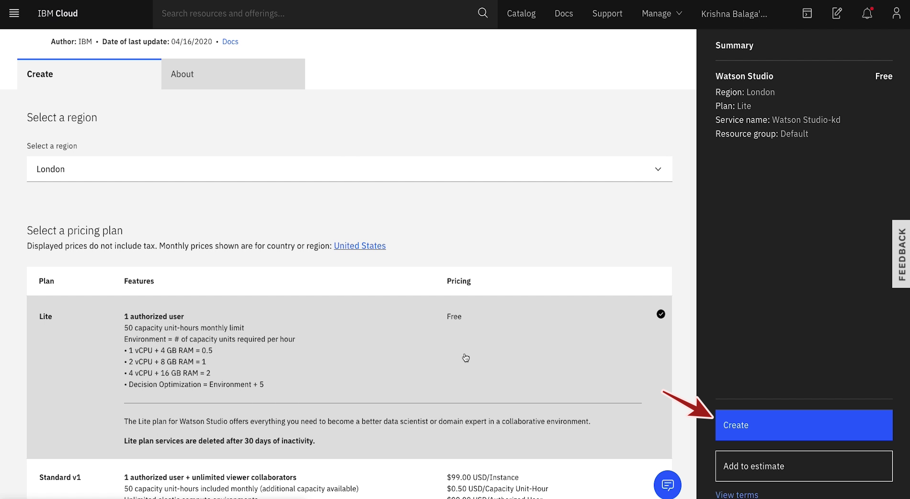
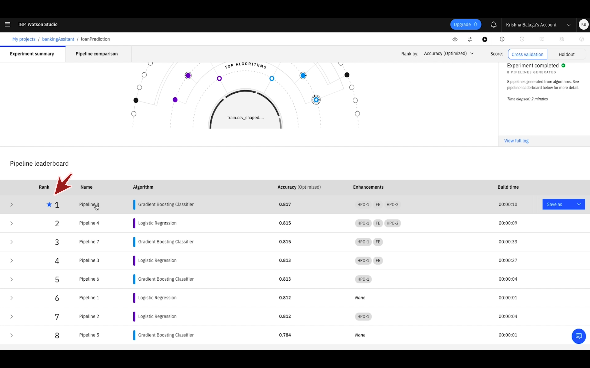
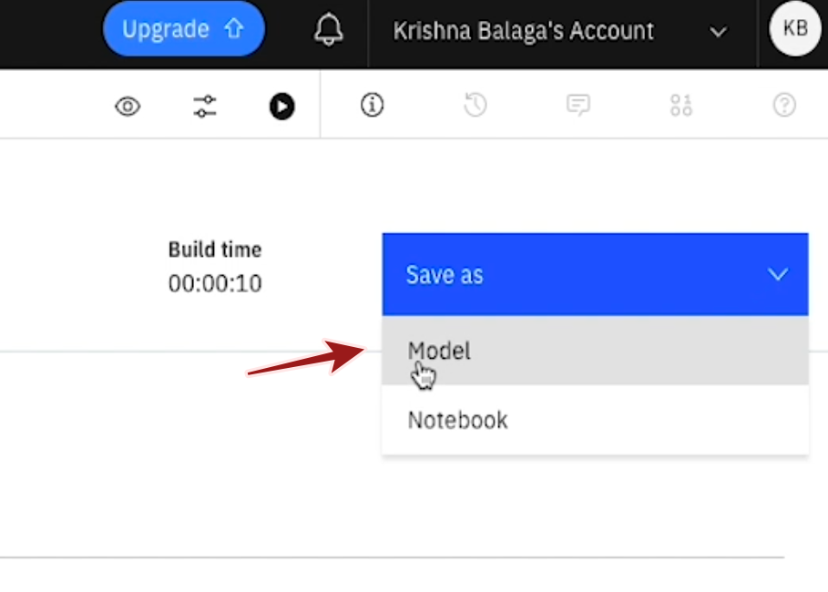
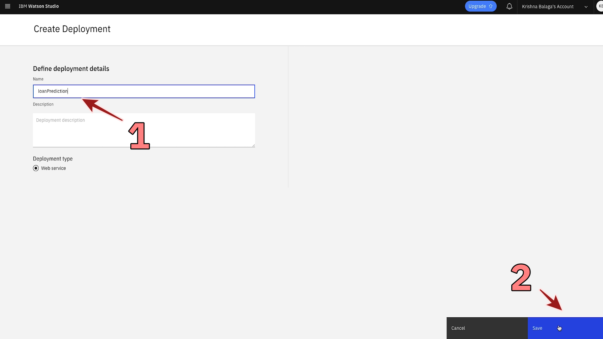
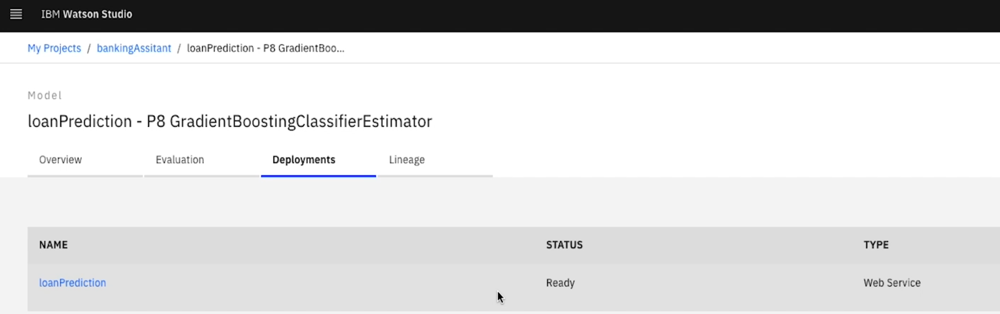

## AutoAI and WML

*Quick links :*
[Home](/README.md) - [**Step 1**](https://github.com/krishnac7/Smart-FAQ-Assistant/tree/master/Step1-Wml) - [Step 2](https://github.com/krishnac7/Smart-FAQ-Assistant/tree/master/Step2-Discovery) - [Step 3](https://github.com/krishnac7/Smart-FAQ-Assistant/tree/master/Step3-Functions) - [Step 4](https://github.com/krishnac7/Smart-FAQ-Assistant/tree/master/Step4-Assistant)
***

### Overview

In this step, you will create a simple machine learning model using AutoAI and save the model using WML(Watson Machine Learning)

### Setup an instance of Watson Studio

1. click on Catalog


you can look at a whole list of services and offerings from ibm cloud
2. Select services tab and Filter by AI


3. click on Watson Studio.

 
 
 
4. You can leave the defaults and click on Create.Do take a minute to look at features you are getting with lite plan of the service




2. Once you click on Create, the service is provisioned. Click on Get Started.It opens a new tab with your watson studio dashboard


3. Once you are in  watson studio dashboard, the first thing we will do is create a project  to work in.click on create a project


4. Select Create an empty project.


4. Give a Unique name to your project.and To add storage to your project, Click on Add.if you see the storage option prefilled, you can skip the next step


5. It will open a new tab where you can create a new instance of object storage. you can select the lite plan and click on create


6. you can leave the defaults and click on confirm.the service name generated for you can be different


7. Once the Object storage is created, you can close the tab and press refresh to see your attached storage


### Run and Auto-AI Experiment

6. Within project, click on 'Add to project' and choose AutoAI Experiment.


7. Choose From blank and Provide a name for your experiment. then click on the 'Associate a machine learning service instance' url


8. select a lite instance and click confirm then create the service.Once the service is created go back to the Auto AI Tab and click on Reload.


9. Click on create and in the next page click pn browse and upload 'train.csv_shaped.csv' or you can also drag and rop the same file on the upload area


9. Select the predict column to be 'loan status' and click on 'Run Experiment'


11. Then the AutoAI experiment starts running. AutoAI will create multiple pipelines.


to further understand how AutoAi works, please refer the [documentation](https://dataplatform.cloud.ibm.com/docs/content/wsj/analyze-data/autoai-overview.html?context=analytics)

12. Once the process is completed, the pipelines are sorted according to the optimization metric and the most efficient pipeline is marked with a star next to it.



## Save the model and create a deployment

13. You can explore the pipeline information by clicking on its name. To save this model, from the right top corner click on Save as and choose model.



14. You can leave the model details as default and click on save


 #### Note: the name generated depends on the algorithm used, sometimes it can be different from what is showed in the illustrations

14. Once the model is saved, click on View in project from the pop-up notification to open the saved model.You can always find it listed in assets tab of your project


15. once the saved model is opened,navigate to deployments tab and click on click on Add Deployment.


16. Provide a name and click on Save.



17. Wait for deployment status to change to Ready and click on the created deployment.



18. In the deployment,navigate to Test tab and input the details and click on Predict to get the predictions from the saved model


19. Now that the model is deployed and you have tested it out, you can switch to the implementation tab and copy the scoring End-Point url


20. We would need a couple of more credentials to access the model, to get them navigate to your [resources dashboard on IBM Cloud](https://cloud.ibm.com/resources)
21. Under services, choose your Machine learning service


22. Navigate to the Service Credentials tab and then create a new set of credentials


23. You can leave the defaults and click on add, once the new set of credentials are added, you will need to copy

```
"apikey":"<Your WML API key>"
"instance_id":"<your WML Instance Id>"
```


we suggest maintaining a single note where you copy all the required credentials as we move forward


### Optional: Refining the data using Data Refinery

5. Go to Assets -> Add to project -> Data -> browse for the dataset train.csv and upload it here. Once the dataset is uploaded, click on refine which will open you the dataset in data refinery. Apply following operations/actions on the dataset.


<TODO: Add actions>


<TODO: Add gifs for data refinery>

Once the data is refined, create a job and save the refined dataset as showed below.

<TODO: Add gif for job creation>

Summary: We have created a machine learning model using autoai experiment and saved it using watson machine learning. And then created a web deployment to test the model.
