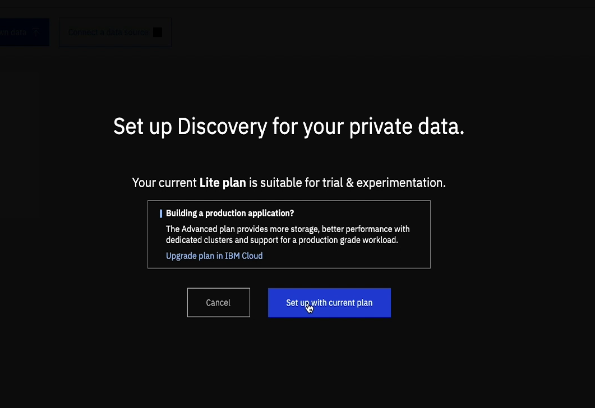

## Watson Discovery

*Quick links :*
[Home](/README.md) - [Step 1](https://github.com/krishnac7/Smart-FAQ-Assistant/tree/master/Step1-Wml) - [**Step 2**](https://github.com/krishnac7/Smart-FAQ-Assistant/tree/master/Step2-Discovery) - [Step 3](https://github.com/krishnac7/Smart-FAQ-Assistant/tree/master/Step3-Functions) - [Step 4](https://github.com/krishnac7/Smart-FAQ-Assistant/tree/master/Step4-Assistant)
***


### Overview

In this, you will provision an instance of Watson Discovery and
1. Navigate to [IBM Cloud Dashboard](https://cloud.ibm.com/)
2. Click on Catalog


you can look at a whole list of services and offerings from ibm cloud

3. Select services tab and Filter by AI


4. Click on Discovery service


5. You can leave the defaults and go ahead to 'create'. wait for the provision to complete and then open the service dashboard


6. Click on 'Launch Watson Discovery' to get started


7. Once in Watson Discovery, click on 'Upload your own Data'


8. When asked for storage options, choose 'Setup with current plan'



9. Once the storage setup is complete, click on 'Continue'

10. when a prompt for naming your collection comes in, give the collection a name and click on create


11. Once the collection is open, you can click on 'Upload documents' and select the [faq_banking.pdf](https://github.com/krishnac7/Smart-FAQ-Assistant/blob/master/Step2-Discovery/faq_banking.pdf) file or Drag and drop it.

12. It might take a little while for initial processing of the document


13. Once the processing is done, you would see some basic enrichments generated from the document


14. Now click on 'Configure Data' to bring up the Smart Document Understanding tool


15. Once you are in SDU, you will see an overview of your Document.Switch to single page View


16. You can click on the 'question' label and start marking the questions column.Do the same for 'answer' label


17. Once ou are happy with the marking, click on submit
18. you can repeat the process for the next 5-6 pages, you will notice that suggestions will be made automatically as you proceed, once you are sure that the model has learnt well and the layouts suggested are good, you can jump to the next step


19. Goto 'Manage fields' tab and in the 'split document by' drop down, select questions


20. then click on Apply changes to the collection, and when asked for upload the same pdf again


21. you can see that now the document has been split into sub-documents basing on the questions column


30. Now you can test out the results by clicking on the query tab and entering a natural language query like 

```
is tax payable on interest charged by banks on outstanding gold loan
```


31. you can further refine the responses using 'more options'


32. Now that we have properly configured our Watson Discovery instance to answer queries from the pdf, lets go ahead and get the credentials to be used

33. click on the api icon on top right and copy
```
Collection ID:
Configuration ID:
Environment ID:
```


34. Navigate to [IBM Cloud services Dashboard](https://cloud.ibm.com/resources)
35. Select your Discovery Instance and navigate to the 'service credentials' tab
36. Create a new set of credentials and copy the

```
"apikey":
"url":
```


Now we can proceed to [Step 3](https://github.com/krishnac7/Smart-FAQ-Assistant/tree/master/Step3-Functions)
