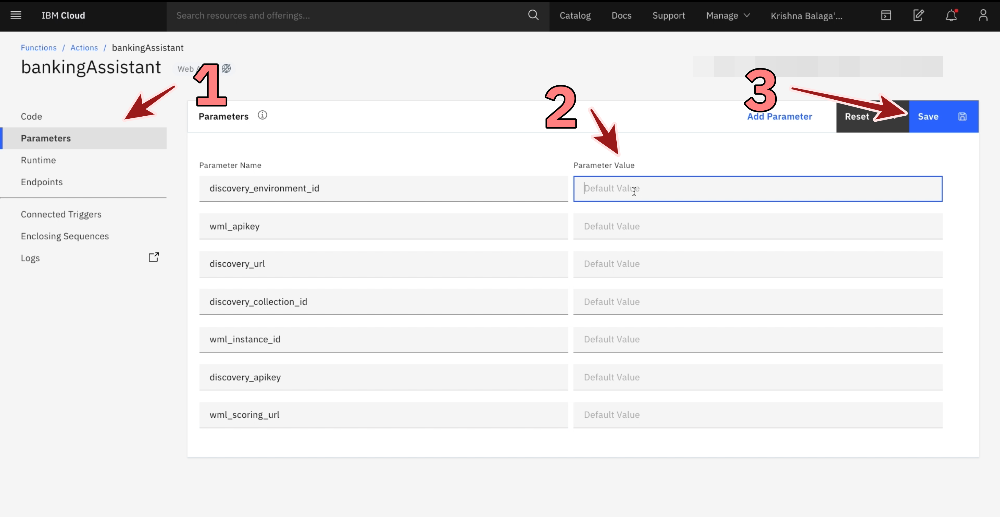

## Functions

*Quick links :*
[Home](/README.md) - [Step 1](https://github.com/krishnac7/Smart-FAQ-Assistant/tree/master/Step1-Wml) - [Step 2](https://github.com/krishnac7/Smart-FAQ-Assistant/tree/master/Step2-Discovery) - [**Step 3**](https://github.com/krishnac7/Smart-FAQ-Assistant/tree/master/Step3-Functions) - [Step 4](https://github.com/krishnac7/Smart-FAQ-Assistant/tree/master/Step4-Assistant)
***


### Overview

In this, you will create an action using cloud functions that will parse the data fetched from Watson Discovery and Watson Machine Learning.

### Create an action in Functions

3.1 ) From the navigation menu, click on [Functions](https://cloud.ibm.com/functions).


3.2 ) Navigate to 'Actions' tab and click on 'create'


3.3 ) choose 'Action'


3.4 ) Provide a name to your action and change the runtime to python 3.7 and click 'Create'.


3.5 ) Paste the code from [main.py] (https://raw.githubusercontent.com/krishnac7/Smart-FAQ-Assistant/master/Step3-Functions/main.py) and then save the function


3.6 ) Go to parameters, click on Add parameter and provide the following parameters that are copied from discovery and watson machine learning services
``` 
    "wml_apikey":"<watson_machine_learning_service_api_key",
    "wml_scoring_url":"<watson_machine_learning_deployment_url>",
    "wml_instance_id":"<watson_machine_learning_service_instance_id",
    "discovery_url":"<watson_discovery_url>",
    "discovery_apikey":"<watson_discovery_apikey>",
     "discovery_environment_id":"<watson_discovery_env_id>",
    "discovery_collection_id":"<watson_discovery_collection_id>"
```
3.7 ) Once the credentials are entered click on 'save'



3.8 ) Go to endpoints, click on "Enable as web Action" and click on save. Then copy the url that is generated in this step.


Once you have the public endpoint copied, now we can proceed to The [Final Step](https://github.com/krishnac7/Smart-FAQ-Assistant/tree/master/Step4-Assistant)
