## Watson Assistant

*Quick links :*
[Home](/README.md) - [Step 1](https://github.com/krishnac7/Smart-FAQ-Assistant/tree/master/Step1-Wml) - [Step 2](https://github.com/krishnac7/Smart-FAQ-Assistant/tree/master/Step2-Discovery) - [Step 3](https://github.com/krishnac7/Smart-FAQ-Assistant/tree/master/Step3-Functions) - [**Step 4**](https://github.com/krishnac7/Smart-FAQ-Assistant/tree/master/Step4-Assistant)
***


### Overview

In this, you will create a simple watson assistant flow and enable webhooks which will fetch details from cloud functions.

### Setup an instance of Watson Assistant

4.1 ) Navigate to [IBM Cloud catalog](https://cloud.ibm.com/catalog). From Catalog, filter the services by AI

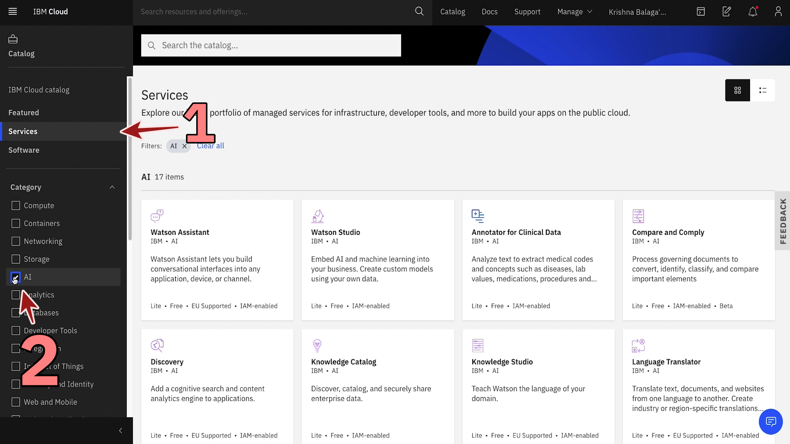

4.2 ) Click on Watson Assistant.

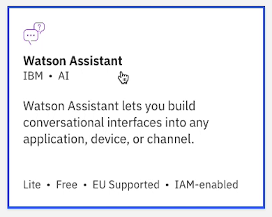

4.3 ) Leave the default values and 'create' a lite service.

4.4 ) One the service is provisioned, click on 'Launch Watson Assistant'

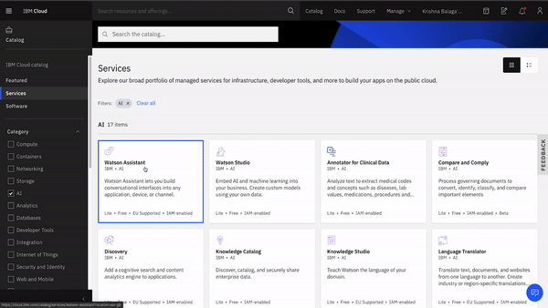


4.5 ) To create a new skill, click on import flow from the top right hand menu. Import the [skill-BankingAssistant.json](https://raw.githubusercontent.com/krishnac7/Smart-FAQ-Assistant/master/Step4-Assistant/skill-BankingAssistant.json) file

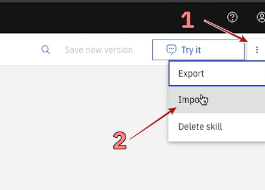

4.6 ) Select 'Import and Overwrite' when prompted

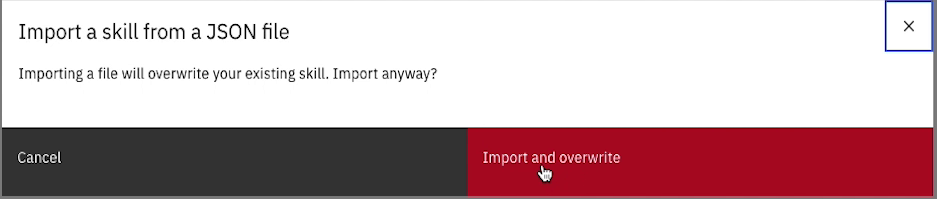

4.7 ) Once you import the flow, you will be able to see intents, entities and dialogs related to the flow.
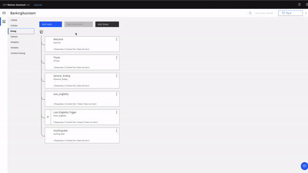

4.8 ) Goto webhooks and paste the url that we copied from the functions and add .json at the end of the url.
## Note: DO NOT FORGET TO ADD .json TO THE END OF WEBHOOK URL

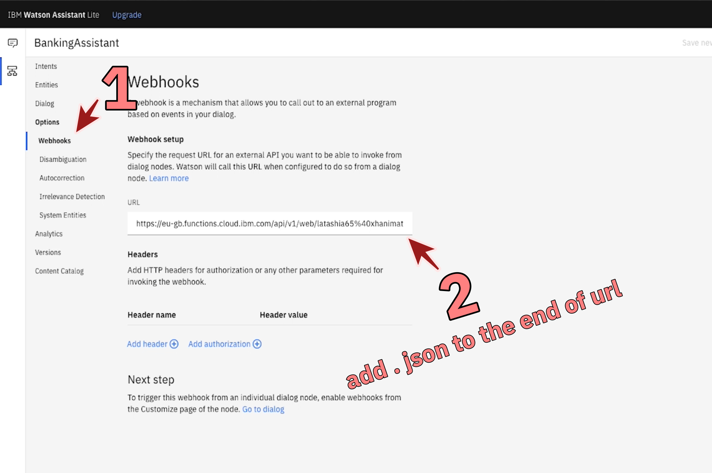

4.9 ) Now click on the assistant icon on the left menu and select your Assistant.

4.10 ) Click on Add integration
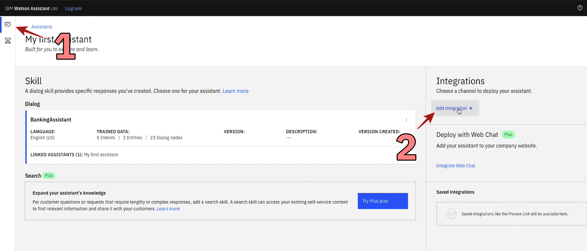

4.11 ) Add a stand-alone 'preview' integration

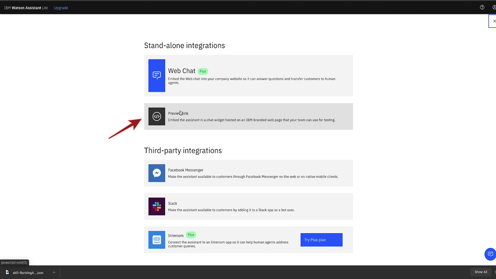

4.12 ) Click on 'Create'
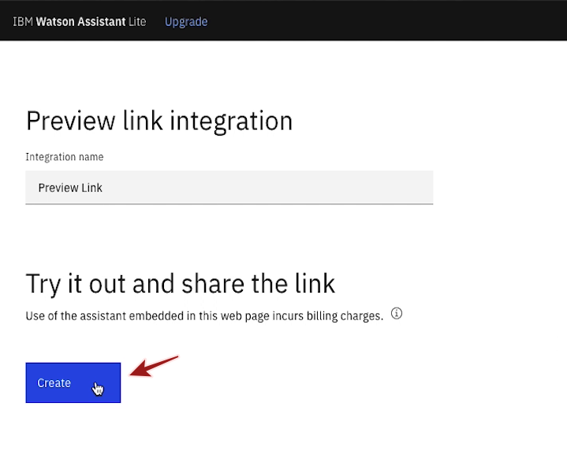

4.13 ) Click on the generated link to open up a preview of your Smart Assistant.

4.14 ) You can query it with any questions related to the document
```
Example:
1. Is interest in debt exempted from gst?

2. Would assignment or sale of unsecured debts be liable to gst?
``` 
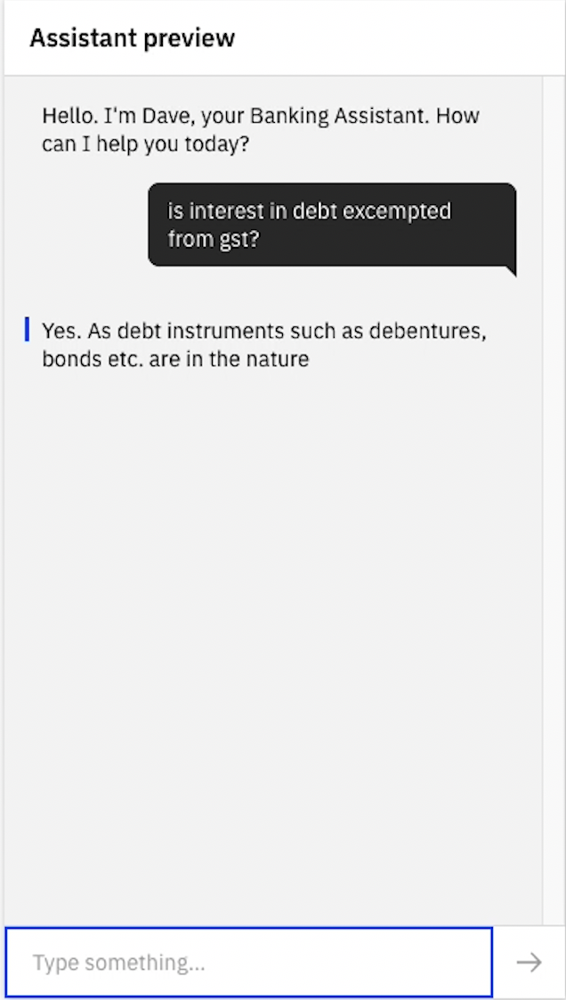

4.15 ) You can check the prediction made by your assistant using Watson machine learning service

```
1. Am i eligible for loan?

Income: 4500
Co-applicant income: 5000
Loan amount: 86000
Term :36
Credit history available: yes
```

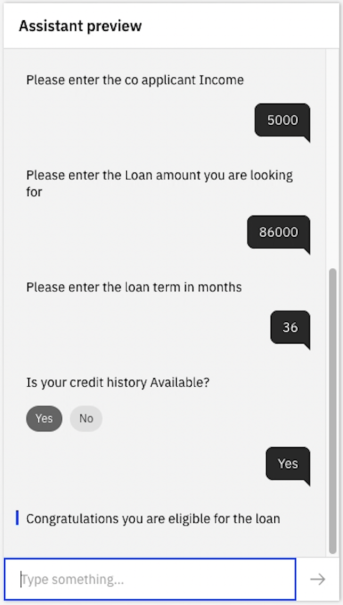


Congratulations! you've deployed a multi functional smart assistant :)
